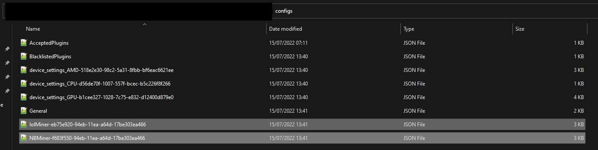
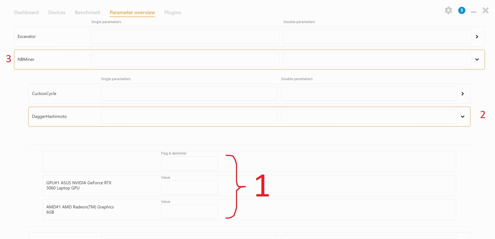
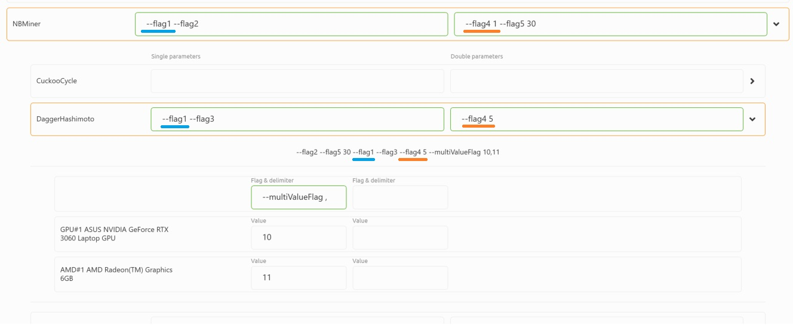
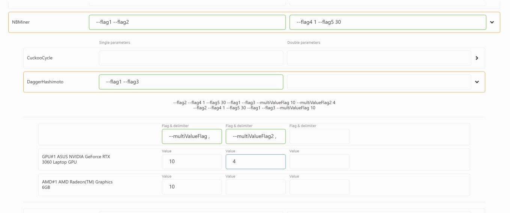
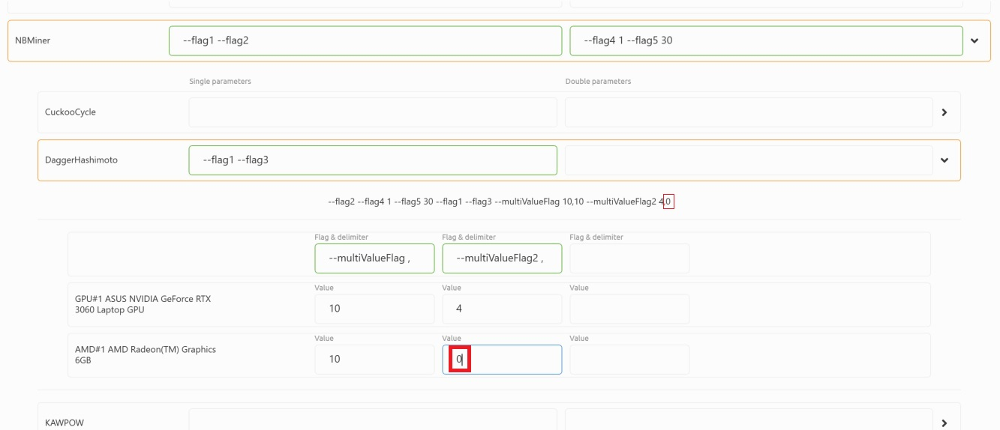

# How to use the parameter view tab
This tab allows advanced users to set extra launch parameters per-miner/per-algorithm/per-device in a corresponding hierarchy.
### Important things to know:
- Configs for this are saved in the `/configs/` directory in the NHM installation folder, the files are named like `MINER_NAME-UUID`, for example `NBMiner-f683f550-94eb-11ea-a64d-17be303ea466`
- If you mess something up, you can just delete the above mentioned files and nhm will generate new ones on restart.

Here is an example of config files, specifically for lolMiner and NBMiner

It is recommended you do not edit the file itself, rather do it through the interface. The interface is built in the following hierarchy:

Every correct entry will trigger a preview update under each algo.

The flags have the priority marked in the image above. For example if a `double parameter` flag is set in both Miner and Algo, the Algo flag will be taken, as it is more nested. You can see this case in the image below, underscored in orange. Also note, the flags do not duplicate, see the blue underscore.

We can also see the correct usage of the device parameters. They are `MULTI-PARAMETER ONLY!`. You must enter a flag and a separator, separated by a space, as shown below.

Please note that if flags cannot group, as shown below (there is a blank space in the second device), there will be multiple instances while mining.
#### It is your responsibility to make sure the flags have correct values.
The below example shows INCORRECT USAGE, because --multiValueFlag2 will be treated as a double parameter flag in a separate instance.

The correct value would be to fill a blank textbox with a default value, such as in the next image. Keep in mind, that you must check out the documentation for a specific miner to see what the default values are for your situation.

