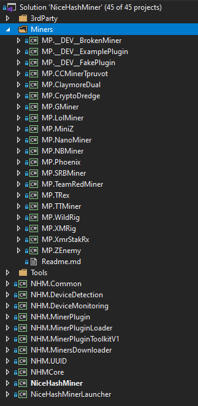
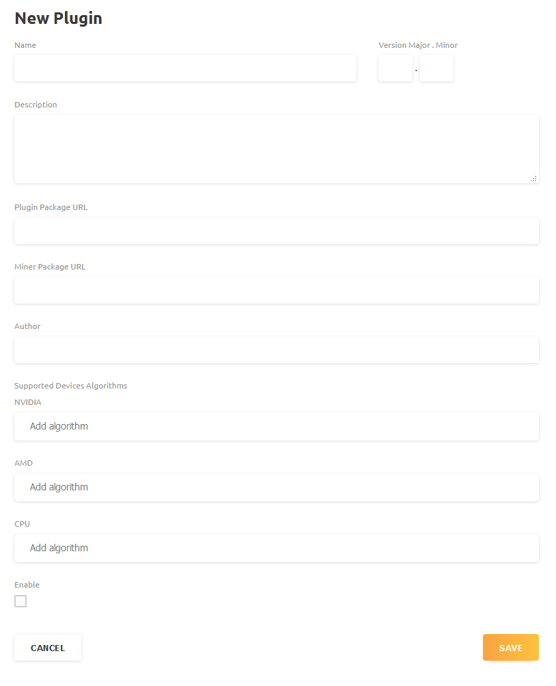

# How to create a new plugin

This document is meant for developers that want to integrate a non-existing plugin into NiceHash Miner.

<h2 id="setup">Setup</h2>

To start with the new plugin project you have to first clone <a href="https://github.com/nicehash/NiceHashMiner">NiceHash Miner project</a> to your development machine.

After that you can open the project in your favourite IDE (we suggest VisualStudio - instructions will be based on using this IDE).

Plugins are located in `NiceHashMiner/src/Miners`. When you open solution file you will see directory straight away. <br>
 <br>
There you can see all available plugins which can serve as example.


<h2 id="create">Create a project</h2>
Inside Miners directory add new project.
Specifications for project are:
<li>Console App (.NET Core)</li>
<li>Location inside <u>NiceHashMiner/src/Miners</u> directory</li>

After you have successfully added the new plugin project right click on it and select `Edit project file`.
Then you change `PropertyGroup` to the following:
```
<PropertyGroup>
    <TargetFrameworks>netstandard2.0</TargetFrameworks>
    <PlatformTarget>x64</PlatformTarget>
</PropertyGroup>
```
Saving that prompts you to reload the project. After that you are ready to start writing code.

*Note: If you prefer using command line please check following tutorials about <a href="https://docs.microsoft.com/en-us/visualstudio/msbuild/walkthrough-creating-an-msbuild-project-file-from-scratch?view=vs-2019">creating</a> and <a href="https://docs.microsoft.com/en-us/visualstudio/msbuild/walkthrough-using-msbuild?view=vs-2019">building</a> a project.*

<h2 id="code">Implement miner plugin</h2>
For working plugin you will need 2 classes: Miner and Plugin.
<li>Plugin class is used for registering a plugin</li>
<li>Miner class is used to implement required functionalities for miner instances</li>

</p>Bare minimum example of plugin is written in <a href="../../src/Miners/__DEV__ExamplePlugin">Example Plugin</a> project. The <a href="../../src/Miners/__DEV__ExamplePlugin/ExamplePlugin.cs">Plugin</a> file contains implementation of IMinerPlugin interface for registration and creation of the plugin instance. The <a href="../../src/Miners/__DEV__ExamplePlugin/ExampleMiner.cs">Miner</a> file contains implementation of IMiner interface, providing required functionalities.</p>


<p>It is <b>recommended</b> to use <b>MinerPluginToolkitV1</b> as this will enable full integration with NiceHash Miner. It will save time developing it and enable implementation of additional advanced features (extra launch parameters, re-benchmark algorithms on device, etc.).<br>

Example:

```
public override IEnumerable<string> CheckBinaryPackageMissingFiles()
{
    var pluginRootBinsPath = GetBinAndCwdPaths().Item2;
    return BinaryPackageMissingFilesCheckerHelpers.ReturnMissingFiles(pluginRootBinsPath, new List<string> { "miner.exe" });
}
```
*This MinerPluginToolkitV1 function allows developer to easly check if all important files were downloaded successfully.*

If you are writing a plugin we highly recommend that you use MinerPluginToolkitV1. All miner plugins that are developed by NiceHash miner dev team are using MinerPluginToolkitV1. For example you can check <a href="../../src/Miners/GMiner">GMiner Plugin</a>.</p>
<p>MinerPluginToolkitV1 also enables creation of <b>Background Services</b>, check out <a href="../../src/NHMCore/Mining/Plugins/EthlargementIntegratedPlugin.cs">Ethlargement plugin</a> for example.</p>

*NOTE: Major plugin versions are raised with the new algorithm, while minor versions on every update.*

<h2 id="test">Test implementation</h2>
When you have implemented your plugin, you would like to test if it works. This can be easly done by using integrated plugins system. You can add your new plugin inside <a href="../../src/NHMCore/Mining/Plugins/MinerPluginsManager.cs">MinerPluginsManager.cs</a> <b>MinerPluginsManager</b> constructor like this: 

```
static MinerPluginsManager()
{
    _integratedPlugins = new List<IMinerPlugin>
    {
        new yourName.yourNamePlugin(),
        ...
    }
```

By doing this, you integrate your plugin which allows it to be downloaded and included at the start of NiceHash Miner program. This is the easiest way to test if your implemenation works like it should.<br>
Rebuild the program and test your plugin.

<h2 id="release">How to release a program</h2>

When you have working miner plugin, head to <a href="https://miner-plugins.nicehash.com">Miner Plugin Author</a> website where you will have to login. <br>
In the page you will have option to create new or update existing plugins.
You can create new one by clicking on `ADD PLUGIN` button. This redirects you to the following form:<br>
 <br>
In the first step you can fill all fields except Plugin Package URL.<br>

*NOTE: Miner Package URL is a link to the archive with the miner executable.<br>
Also check which versions are supported by the latest clients. This can be checked in the <a href="../../src/NHM.MinerPluginToolkitV1/Checkers.cs">Checkers.cs</a> file, inside `_supportedMajorVersions` array.*<br>

**WARNING: Do not tick the `Enable` checkbox.**<br>

When you click `SAVE` new plugin will be created and added to your list. If you select `EDIT` you will be able to copy newly created plugin ID. Copy it and replace the current `PluginUUID` in your MinerPlugin implementation (Plugin class) => this step is needed for successfull binding. <br><br>
After that you can create a release library version of the plugin. When you create release build your library version will be saved to `PluginDirectory/obj/Release/net45` with name `PluginName.dll`. 
Create zip or 7z archive of the dll file.<br>
Upload newly created archive to reachable server and fill the `Plugin Package URL` field in the edit form on Miner Plugin Author website. <br>Now you can tick the `Enable` checkbox.

Double check if you have filled every field, and that both Plugin and Miner package URLs are reachable. Then you can save the plugin.<br>
Now your plugin is released and accessible for the NiceHash Miner users to download (Miner Plugin Author cache gets updated every 30 minutes so it might not be instant accessible).