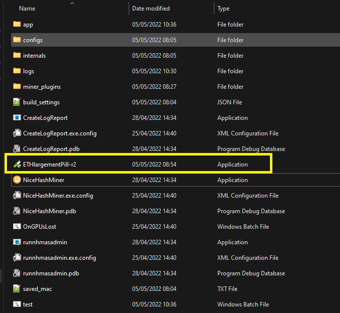
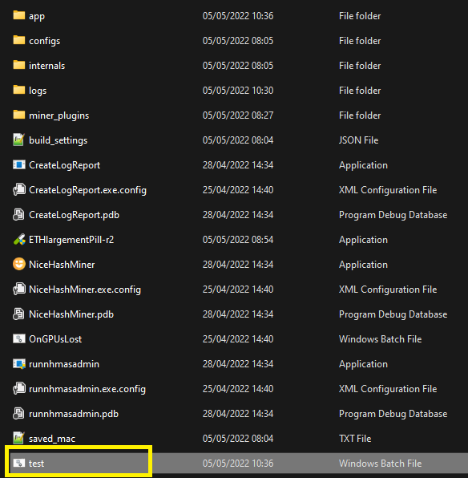
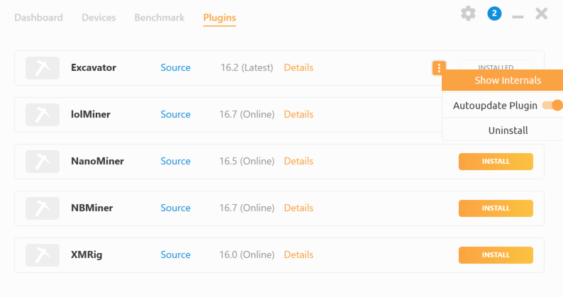
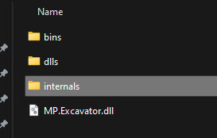

# Miner custom action settings

Located inside `miner_plugins/somePlugin/internals`, the **MinerCustomActionSettings.json** file allows user to set arbitrary scripts before running and after running the miner.

The file consists of `use_user_settings` and `algorithm_custom_actions` sections.

Settings that open the calculator before and after starting the miner. NOTE you must set `use_user_settings` to `true`.

Example file (run calculator):
```JSON
{
  "use_user_settings": true,
  "algorithm_custom_actions": {
      "DaggerHashimoto": {
          "start": "calc",
          "wait_start_exec": true,
          "stop": "calc",
          "wait_stop_exec": false
      }
  }
}
```
- `algorithm_custom_actions`: a list of algorithms for the plugin with start and stop desired executables and bat scripts
- `start`: run Windows calculator before running the actual miner
- `stop`: run Windows calculator before stopping the actual miner
- `wait_start_exec`: this indicates if it should wait for the start script to finish executing
- `wait_stop_exec`: this indicates if it should wait for the stop script to finish executing

## How to use Ethlargement-Pill (even though it has been removed)

Since Ethlargement-pill was removed from the official NHM release you must download the executable yourself.

Place the downloaded .exe in the installation directory of your NHM. <br />

 <br />

In order to ensure that only one ethlargement process is running, create a .bat file in the NHM installation directory (we will name it `test.bat`): <br />

 <br />

Right click the `test.bat` and edit in any text editor. Paste in the following command and save the file:
```BAT
tasklist /nh /fi "imagename eq ETHlargementPill-r2.exe" | find /i "ETHlargementPill-r2.exe" > nul || (start ETHlargementPill-r2.exe)
```
The above bat script checks if the ethlargement process is already running, and starts it only if it is not. Please be aware that the name of the executable may change so you will need to change all references to the .exe accordingly.

Open NHM and go to the `Plugins` tab and select the plugin you wish to open ethlargement with, open the context menu and click on `Show internals`: <br />

 <br />

Navigate to the folder `internals` <br />

 <br />

Open `MinerCustomActionSettings.json` <br />

 <br />

Paste the following to `MinerCustomActionSettings.json` and save the file:
```JSON
{
  "use_user_settings": true,
  "algorithm_custom_actions": {
      "DaggerHashimoto": {
          "start": "test.bat",
          "wait_start_exec": true,
          "stop": "",
          "wait_stop_exec": false
      }
  }
}
``` 
Restart NHM and start mining on the modified plugin. If you did everything correctly, you will see Ethlargement window open after you click `start mining`.

### IMPORTANT:
- You will be prompted for administrator rights when `ETHlargementPill-r2.exe` starts!!
- After making changes to the mentioned files, please restart NHM.
- After you are done with mining, manually close the Ethlargement-Pill window.