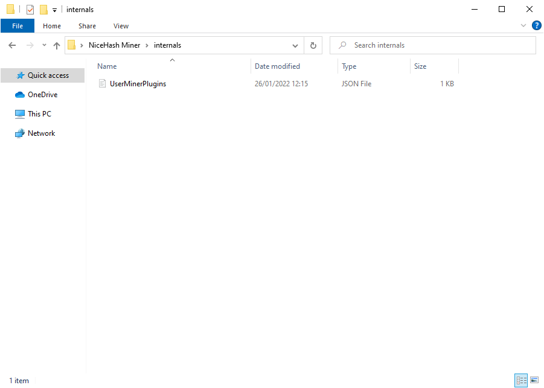
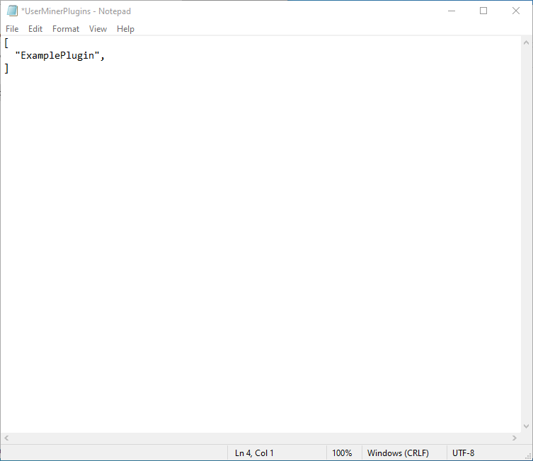
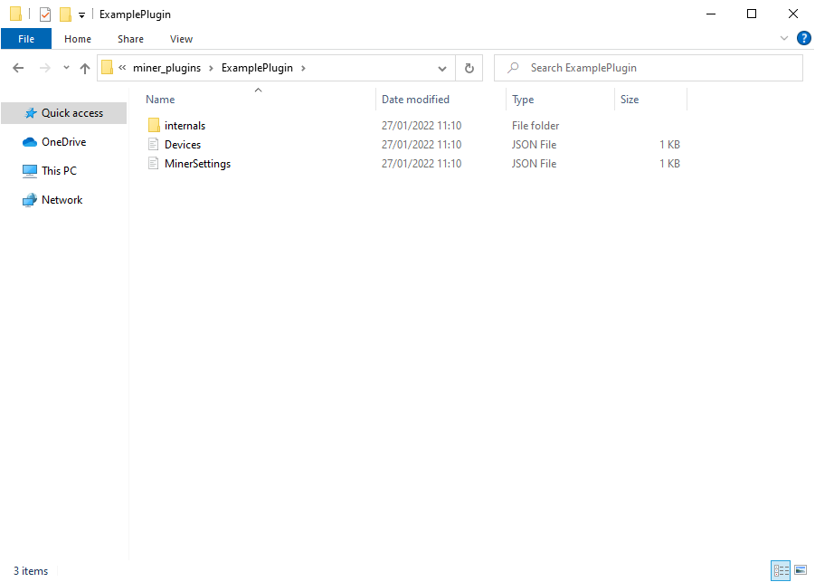
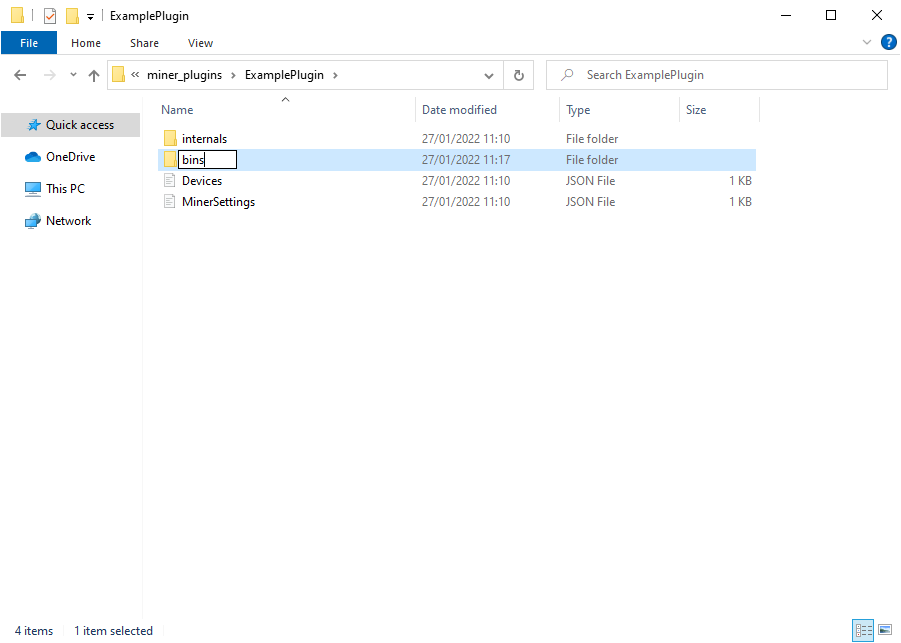
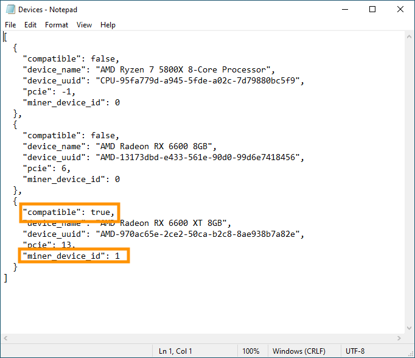
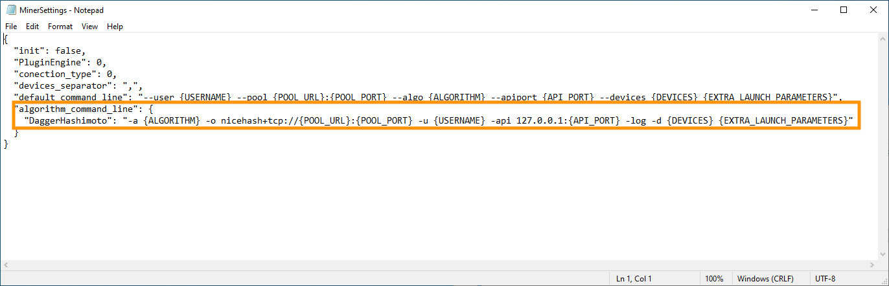
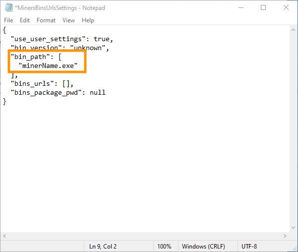

# About
NiceHash Miner from version 3.0.7.0 supports generic plugins for experimental purposes. This guide is intended for advanced users only. User needs basic understanding of JSON since all the setting files are in JSON format.

# Notice: Generic plugin usage is not officially supported by NiceHash. The support team will not be able to assist you.

# Follow these instructions to create a new plugin:

## #1 Generating generic plugin files

### 1 First, navigate to the **NiceHash Miner root directory > internals > UserMinerPlugins.json** 

### 2 Add a plugin name here, we will use **ExamplePlugin**. 

### 3 Start NiceHash Miner for the files to be created automatically. Close NiceHash Miner after it initializes.

### 4 New files will be generated in the **..\miner_plugins\ExamplePlugin** directory. 

## #2 Moving the miner files to plugin bins directory

### 1 Download the preferred miner from the official source.

 

### 2 Create a new folder named **bins** in the **NiceHash Miner\miner_plugins\ExamplePlugin** directory and move the miner file (all files included in the miner folder, not just the executable) to the **bins** directory.

 

## #3 Editing the plugin settings

### 1 Open **NiceHash Miner\miner_plugins\ExamplePlugin\Devices.json** and mark each compatible device as compatible with the plugin by changing **`"compatible": false`** to **`"compatible": true`**.  If the miner uses custom device IDs (has different GPU detection technique), make sure to manually change the device ID ("miner_device_id") also.
 

### 2 Open NiceHash Miner\miner_plugins\ExamplePlugin\MinerSettings.json and change the algorithm_command_line to a compatible command for the selected miner. You can use all the placeholders from the top default_command_line. Example of a algorithm_command_line: `-a {ALGORITHM} -o nicehash+tcp://{POOL_URL}:{POOL_PORT} -u {USERNAME} -api 127.0.0.1:{API_PORT} -log -d {DEVICES} {EXTRA_LAUNCH_PARAMETERS}` Optionally, change the "device_seperator" for the miner. 

 

### 3 Navigate to ExamplePlugin\Internals and open MinersBinsUrlsSettings.json

Change the `"bin_path"` to the miner executable name. Do not use any specific path, NHM will automatically look for the miner in NiceHash Miner\miner_plugins\ExamplePlugin\bins.

 

# Additional information
Navigate to `NiceHash Miner\miner_plugins\ExamplePlugin\internals` and check the included files. There are other customizations possible through these files. Including adding extra launch parameters and supported algorithms. All of the settings are self-explanatory to advanced users.

You can find more information about plugin internal settings [here](https://github.com/nicehash/NiceHashMiner/tree/master/doc/Plugins/InternalSettings).

Tip: For easy migration, simply copy the internals directory files from the existing plugin and paste it in the new plugin. Remember to set user_settings to true when editing the files.
